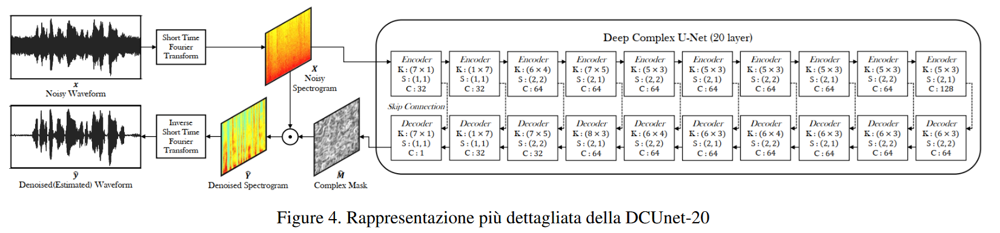
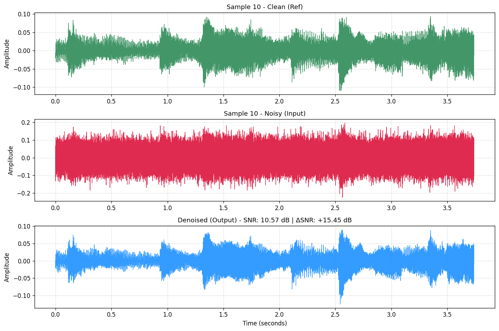
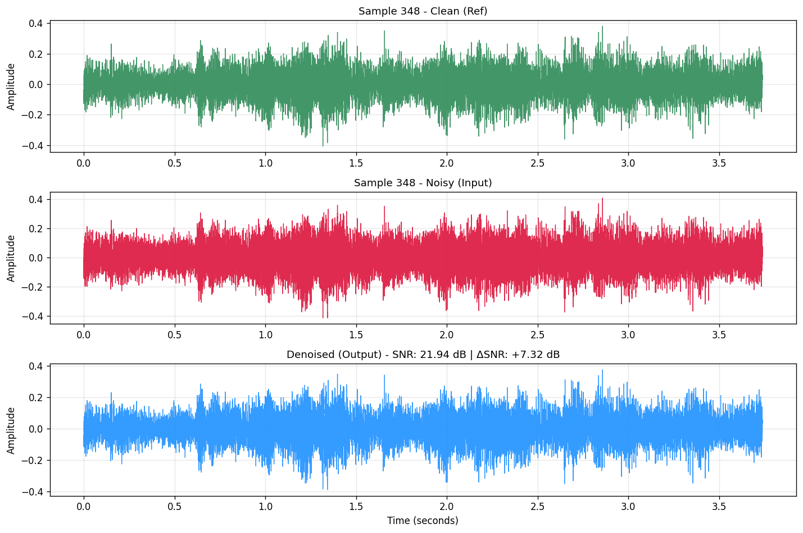
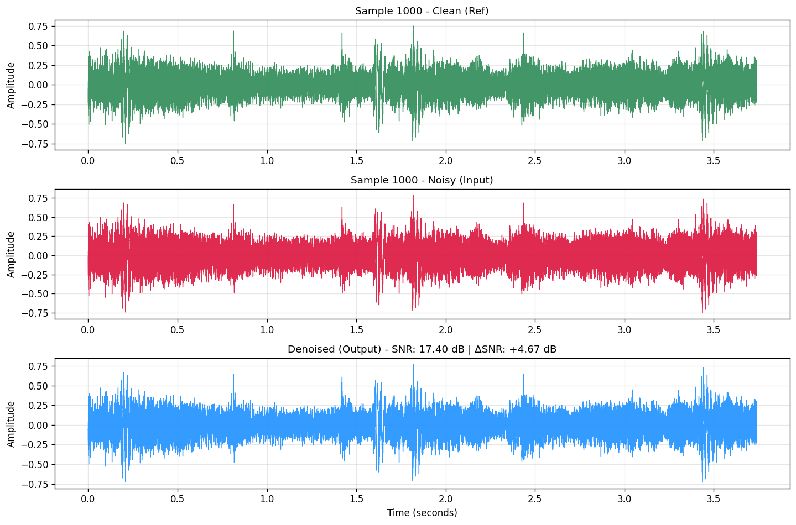
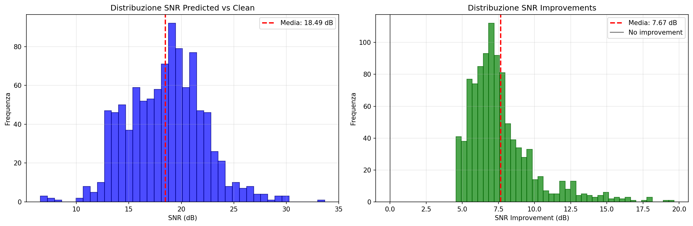
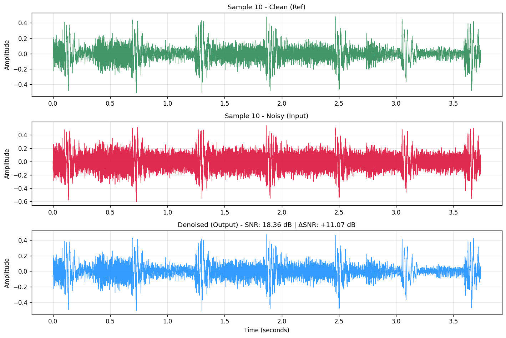
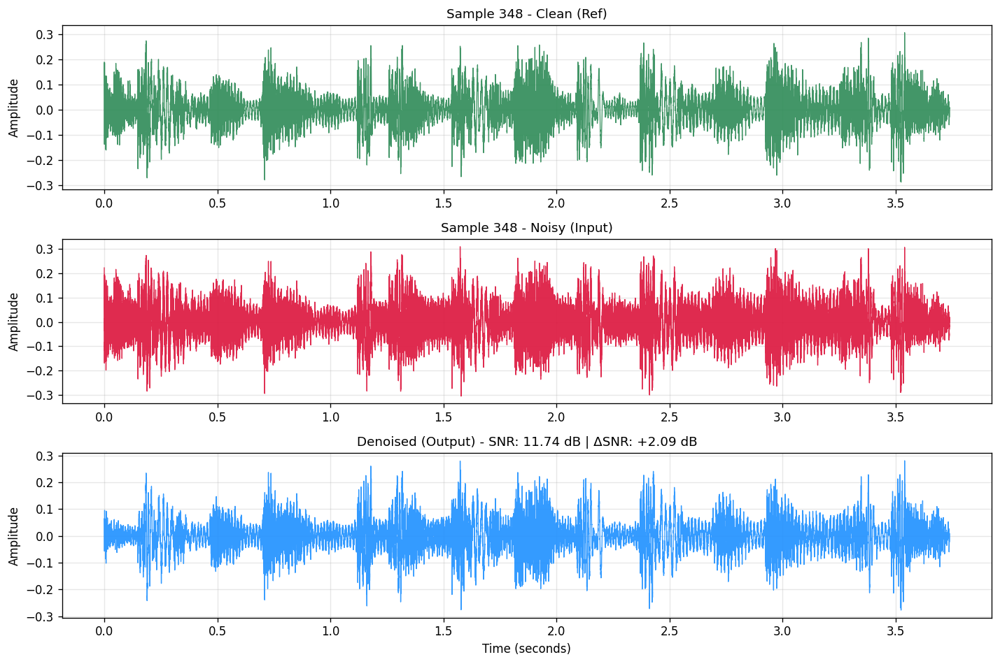
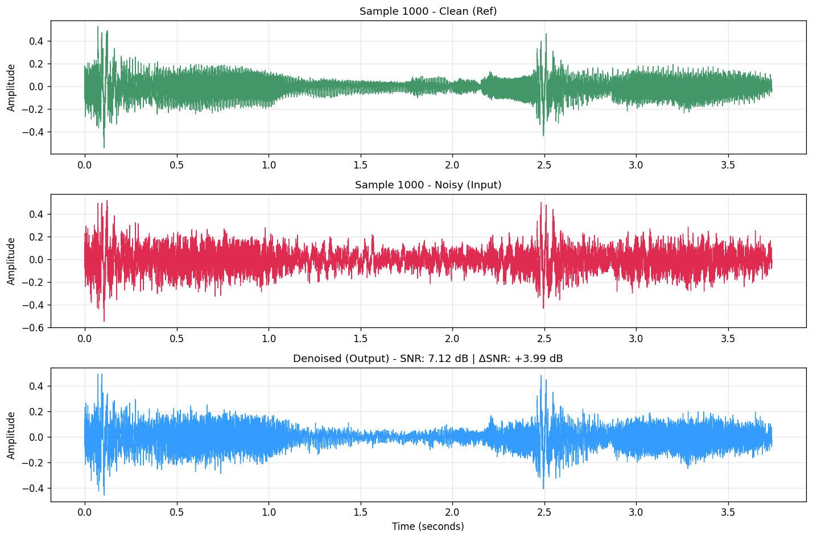
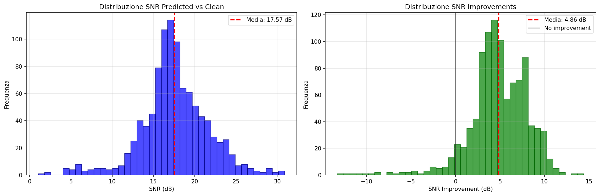
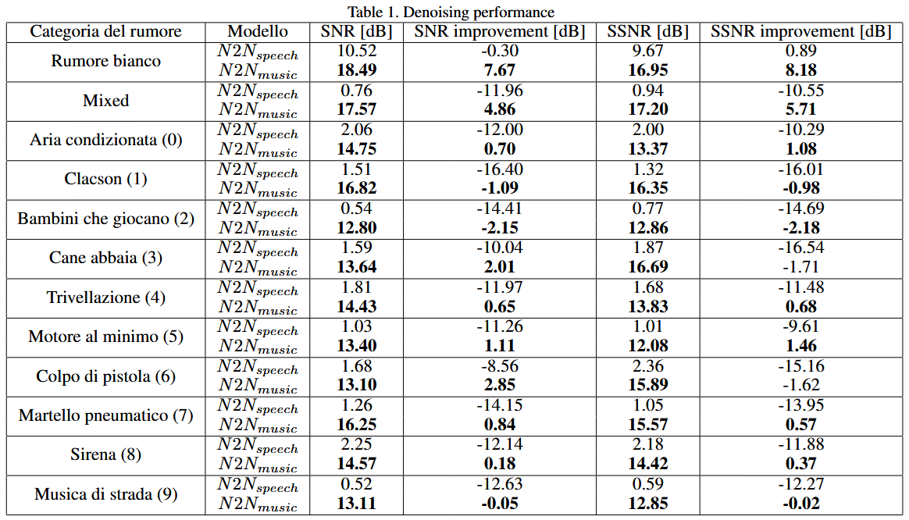

# Riduzione del rumore delle canzoni senza dati di addestramento puliti

## Descrizione

Questo repository implementa un sistema di **denoising audio musicale** tramite **Deep Learning**, seguendo la metodologia **Noise2Noise**: l’addestramento avviene esclusivamente con segnali rumorosi, **senza la necessità di dati puliti come target**.  
L’obiettivo è dimostrare che è possibile addestrare una rete neurale profonda (Deep Complex U-Net a 20 livelli) direttamente su dati musicali rumorosi per la riduzione del rumore, superando i limiti dei metodi basati su speech o dati puliti, e di validarne le prestazioni e la pipeline di ricerca.

## Requisiti in Python

- Creare un ambiente Python ≥ 3.8 (si consiglia l’uso di `venv` o `conda`).
- Installare i pacchetti richiesti:

```
pip install -r requirements.txt
```

## Generazione dei dataset

- **Dataset utilizzati**: [UrbanSound8k](https://urbansounddataset.weebly.com/urbansound8k.html), [musdb18](https://sigsep.github.io/datasets/musdb.html)
- **[Dataset generati](LinkDatasetKaggle.md)**

---

### Solo rumori reali

```
python merger.py --path-songs <dir_canzoni> --path-noises <dir_rumori> --iter-songs <num_canzoni> --iter-noise <num_rumori_per_canzone> --use-cuda --input-dir <dir_output_input> --target-dir <dir_output_target>
```

- `--path-songs`: Directory delle canzoni in formato MP4.
- `--path-noises`: Directory contenente file di rumore WAV, suddivisi in sottocartelle `fold1, ..., fold10`.
- `--iter-songs`: Numero massimo di canzoni da processare.
- `--iter-noise`: Numero massimo di coppie di rumori da sovrapporre per ogni canzone.
- `--use-cuda`: Flag opzionale per usare la GPU CUDA, se disponibile.
- `--input-dir`: Directory dove salvare i file audio di input (canzone + rumore1).
- `--target-dir`: Directory dove salvare i file target (canzone + rumore2 o canzone pulita).

### Dataset per una specifica classe N

```
python merger_class.py --class-num <numero_categoria> --path-canzoni <dir_canzoni> --path-rumori <dir_rumori> --iter-songs <num_canzoni> --iter-noise <num_rumori_per_canzone> --use-cuda --input-dir <dir_output_input> --target-dir <dir_output_target>
```

- `--class-num`: Numero intero della categoria rumore (0–9) da includere.
- `--path-songs`: Directory delle canzoni musdb18.
- `--path-noises`: Directory dei rumori UrbanSound8K.
- `--iter-songs`: Numero massimo di canzoni da usare.
- `--iter-noise`: Numero massimo di rumori da sovrapporre per canzone.
- `--use-cuda`: Usa GPU CUDA se disponibile.
- `--input-dir`: Directory output per i file INPUT.
- `--target-dir`: Directory output per i file TARGET.

### Rumori reali + rumore bianco

```
python merger_mixed_white.py --path-songs <dir_canzoni> --path-noises <dir_rumori> --iter-songs <num_canzoni> --iter-noise <num_rumori_per_canzone> --use-cuda --input-dir <dir_output_input> --target-dir <dir_output_target>
```

- `--path-songs`: Directory delle canzoni.
- `--path-noises`: Directory contenente file di rumore WAV (UrbanSound8K).
- `--iter-songs`: Numero di canzoni da elaborare.
- `--iter-noise`: Numero di coppie di rumori per canzone.
- `--use-cuda`: Usa GPU CUDA se disponibile.
- `--input-dir`: Directory output per file INPUT.
- `--target-dir`: Directory output per file TARGET.

### Solo rumore bianco

```
python merger_white.py --path-songs <dir_canzoni> --iter-songs <num_canzoni> --iter-white-noise <num_rumori_bianchi_per_canzone> --use-cuda --input-dir <dir_output_input> --target-dir <dir_output_target>
```

- `--path-songs`: Directory delle canzoni (MP4).
- `--iter-songs`: Numero di canzoni da elaborare.
- `--iter-white-noise`: Numero di coppie di rumore bianco per canzone.
- `--use-cuda`: Usa GPU CUDA se disponibile.
- `--input-dir`: Directory per i file INPUT.
- `--target-dir`: Directory per i file TARGET.

### Analisi di correlazione tra file audio

```
python correlation.py <path_audio1> <path_audio2> <output_file>
```

- `<path_audio1>`: Prima directory contenente file audio WAV.
- `<path_audio2>`: Seconda directory contenente file audio WAV.
- `<output_file>`: File di output con i risultati dell’analisi.

## Allenare un nuovo modello

Per allenare un modello è disponibile il notebook [`NoiseRemover.ipynb`](NoiseRemover.ipynb).  
È necessario generare prima un dataset (singola classe, rumore bianco o mixed) e segmentarlo con il notebook [`generate_best_segments.ipynb`](scripts/generate_best_segments.ipynb). Questo notebook prende tutti i brani del dataset e salva in una cartella i segmenti che ottimizzano correlazione e diversità spettrale, così da poterli usare come nuovo dataset.

- Windows: impostare `soundfile` come backend Torchaudio.
- Linux: impostare `sox` come backend Torchaudio.

Vengono salvati nella directory `Weights` i pesi (`.pth`) relativi all'epoca con miglioramento ottimale del SNR.

## Verifica dell'inferenza su pesi pre-addestrati

Abbiamo addestrato il modello per tutte le 10 classi di UrbanSound8K (0–9) e per il rumore bianco gaussiano.  
Tutti i pesi sono disponibili in [`pretrained_weights`](pretrained_weights).

Nel notebook [`NoiseRemover.ipynb`](NoiseRemover.ipynb), selezionare il file `.pth` da utilizzare.  
Verranno calcolate metriche di qualità audio e i risultati saranno salvati nella directory `Samples`.

## Ridurre il rumore di un intero brano

Utilizzare il notebook [`denoising_entire_song.ipynb`](scripts/denoising_entire_song.ipynb), modificando le costanti iniziali:
- `MODEL_PATH` → percorso ai pesi del modello da usare
- `INPUT_AUDIO_PATH` → audio in ingresso
- `OUTPUT_AUDIO_PATH` → audio in uscita

## 20-Layered Deep Complex U-Net



## Esempi e Risultati

### Rumore bianco
<table>
<tr>
<td rowspan="3" ><p align="center">Sample 10</p></td>
<td><video src="https://github.com/user-attachments/assets/00dd41c6-6adb-4ee6-851f-91f8dae9502c"> </td>
</tr>
<tr>
<td><video src="https://github.com/user-attachments/assets/3397a935-d2ee-4130-b09c-9af517585b40"> </td>
</tr>
<tr>
<td><video src="https://github.com/user-attachments/assets/8aa3a927-8e41-4bf2-a0dc-c228f6a09fd7"> </td>
</tr>
</table>

<table>
<tr>
<td rowspan="3" ><p align="center">Sample 348</p></td>
<td><video src="https://github.com/user-attachments/assets/f7fbc247-3c46-4cb3-acfa-5f9f3db65f9b"> </td>
</tr>
<tr>
<td><video src="https://github.com/user-attachments/assets/b3f1ce07-d663-4be8-abcf-584e41b75505"> </td>
</tr>
<tr>
<td><video src="https://github.com/user-attachments/assets/e2abd57a-a3e3-4032-bccd-efb3e4424a34"> </td>
</tr>
</table>

<table>
<tr>
<td rowspan="3" ><p align="center">Sample 1000</p></td>
<td><video src="https://github.com/user-attachments/assets/816dc63d-1c17-4553-91cc-17b4694a50a9"> </td>
</tr>
<tr>
<td><video src="https://github.com/user-attachments/assets/005fde8a-2ac7-4def-a118-e85c6f26101c"> </td>
</tr>
<tr>
<td><video src="https://github.com/user-attachments/assets/05e5dfa7-2bd5-49b7-aa21-44c3f66ed10c"> </td>
</tr>
</table>

#### Distribuzione SNR di tutto il testset
  

### Mixed
<table>
<tr>
<td rowspan="3" ><p align="center">Sample 10</p></td>
<td><video src="https://github.com/user-attachments/assets/dc617e0f-ee3b-4b82-b509-9bfaaeb25c7f"> </td>
</tr>
<tr>
<td><video src="https://github.com/user-attachments/assets/efc8d061-f747-4a0e-ace6-c4532e24034d"> </td>
</tr>
<tr>
<td><video src="https://github.com/user-attachments/assets/73e5d4ed-5307-4a38-9b58-f3d79fb2ced3"> </td>
</tr>
</table>

<table>
<tr>
<td rowspan="3" ><p align="center">Sample 348</p></td>
<td><video src="https://github.com/user-attachments/assets/66ac4fd0-0e13-4910-b274-b670c45dd902"> </td>
</tr>
<tr>
<td><video src="https://github.com/user-attachments/assets/f3a75710-82b8-4910-a2b8-623bae6f8a38"> </td>
</tr>
<tr>
<td><video src="https://github.com/user-attachments/assets/2e301bec-ab9f-43ec-889f-8a5943a24e64"> </td>
</tr>
</table>

<table>
<tr>
<td rowspan="3" ><p align="center">Sample 1000</p></td>
<td><video src="https://github.com/user-attachments/assets/320cf993-4dbc-4a8f-a462-cd0b24bed1c6"> </td>
</tr>
<tr>
<td><video src="https://github.com/user-attachments/assets/1a5c3888-db99-4433-8592-b445e3e23e93"> </td>
</tr>
<tr>
<td><video src="https://github.com/user-attachments/assets/d345c531-a236-42f6-a555-59fbf7c1e5d3"> </td>
</tr>
</table>


#### Distribuzione SNR di tutto il testset
  

### Prestazioni rispetto alla rete di riferimento


## Riferimenti

1. J. Allen. *Short term spectral analysis, synthesis, and modification by discrete Fourier transform*. IEEE Transactions on Acoustics, Speech, and Signal Processing, 25(3):235–238, 1977.
2. H.-S. Choi, J.-H. Kim, J. Huh, A. Kim, J.-W. Ha, and K. Lee. *Phase-aware speech enhancement with deep complex U-Net*, 2019.
3. X. Glorot and Y. Bengio. *Understanding the difficulty of training deep feedforward neural networks*. AISTATS, 2010.
4. M. M. Kashyap et al. *Speech denoising without clean training data: A Noise2Noise approach*. Interspeech 2021. https://github.com/madhavmk/Noise2Noise-audio_denoising_without_clean_training_data
5. Z. Lai et al. *Rethinking skip connections in encoder-decoder networks for monocular depth estimation*, 2022.
6. Y. LeCun, Y. Bengio, G. Hinton. *Deep learning*. Nature, 2015.
7. J. Lehtinen et al. *Noise2Noise: Learning image restoration without clean data*, 2018.
8. Z. Rafii et al. *The MUSDB18 corpus for music separation*, 2017. https://sigsep.github.io/datasets/musdb.html
9. O. Ronneberger, P. Fischer, T. Brox. *U-Net: Convolutional networks for biomedical image segmentation*, 2015.
10. J. Salamon et al. *A dataset and taxonomy for urban sound research*. ACM Multimedia, 2014. https://urbansounddataset.weebly.com/urbansound8k.html
11. C. Trabelsi et al. *Deep complex networks*, 2018.
