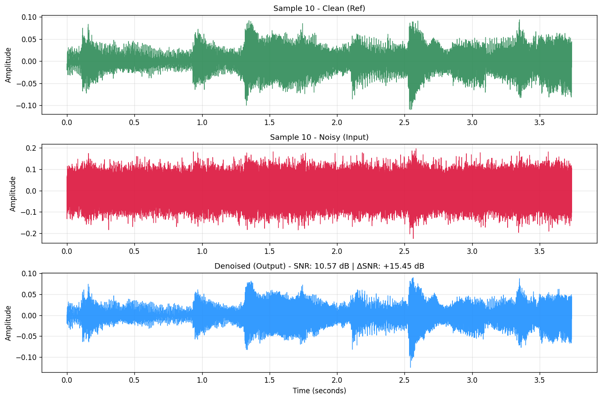
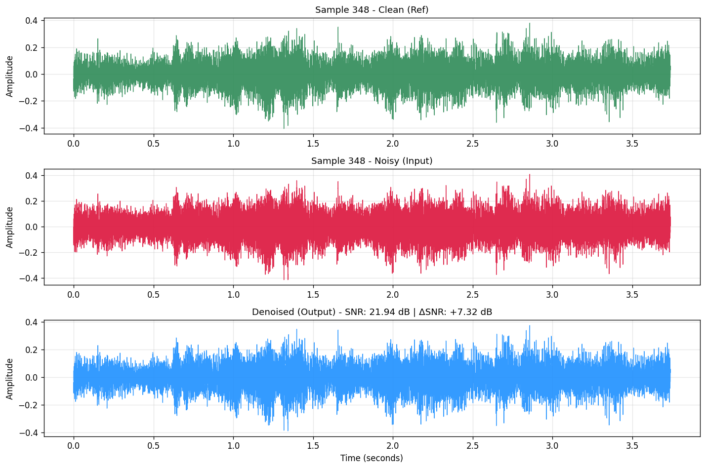
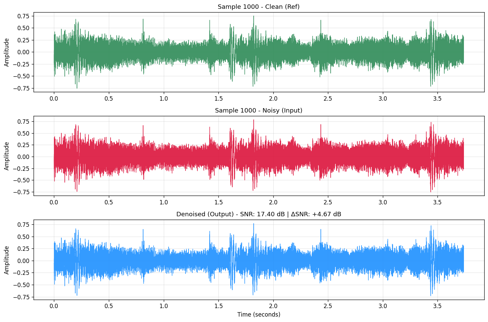
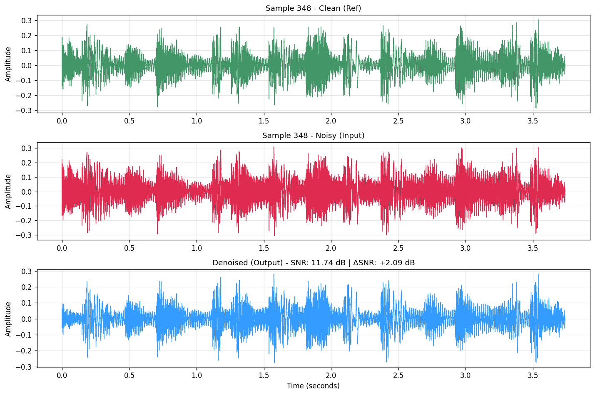
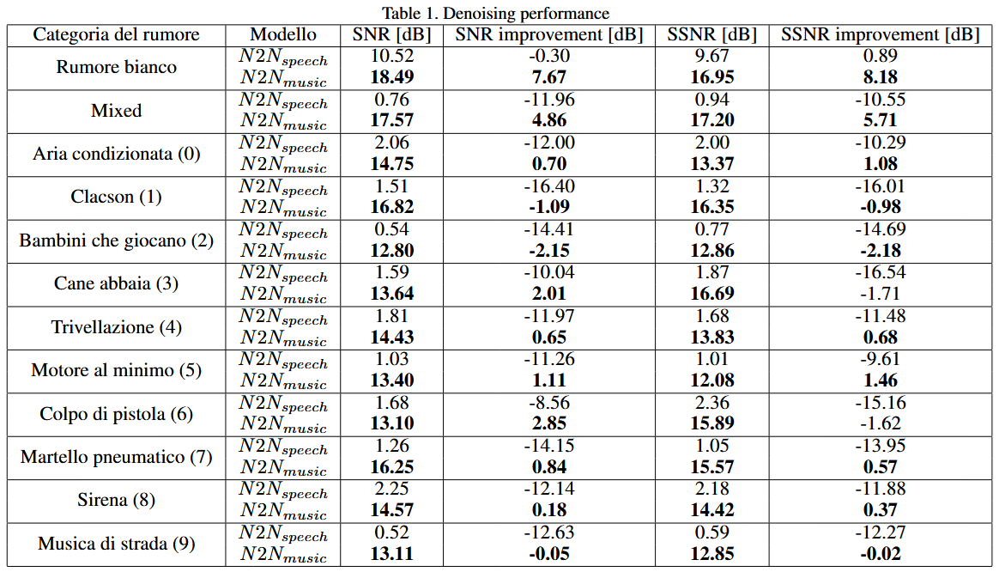

# Song Noise Reduction Without Clean Training Data

## Description

This repository implements a **music audio denoising** system using **Deep Learning** and follows the **Noise2Noise** methodology: training occurs exclusively with noisy signals, **without requiring clean data as the target**.  
The goal is to show that a deep neural network (20-layer Deep Complex U-Net) can be trained directly on noisy music data for noise reduction, overcoming the limitations of speech- or clean-data-based methods, and to validate its performance and research pipeline.

## Python Requirements

- Create a Python environment ≥ 3.8 (it is recommended to use `venv` or `conda`).
- Install the required packages:

```
pip install -r requirements.txt
```

## Dataset Generation

- **Datasets used**: [UrbanSound8k](https://urbansounddataset.weebly.com/urbansound8k.html), [musdb18](https://sigsep.github.io/datasets/musdb.html)
- **[Generated Datasets](LinkDatasetKaggle.md)**

---

### Only Real Noises

```
python merger.py --path-songs <songs_dir> --path-noises <noises_dir> --iter-songs <num_songs> --iter-noise <noises_per_song> --use-cuda --input-dir <input_output_dir> --target-dir <target_output_dir>
```

- `--path-songs`: Directory of the songs in MP4 format.
- `--path-noises`: Directory containing WAV noise files, separated in folders `fold1, ..., fold10`.
- `--iter-songs`: Max number of songs to process.
- `--iter-noise`: Max number of noise pairs to overlap per song.
- `--use-cuda`: Optional flag to use CUDA GPU, if available.
- `--input-dir`: Directory to save input audio files (song + noise1).
- `--target-dir`: Directory to save target audio files (song + noise2 or clean song).

### Dataset for a Specific Class N

```
python merger_class.py --class-num <category_number> --path-songs <songs_dir> --path-noises <noises_dir> --iter-songs <num_songs> --iter-noise <noises_per_song> --use-cuda --input-dir <input_output_dir> --target-dir <target_output_dir>
```

- `--class-num`: Integer of the noise category (0–9) to include.
- `--path-songs`: Directory for musdb18 songs.
- `--path-noises`: Directory for UrbanSound8K noises.
- `--iter-songs`: Max number of songs to use.
- `--iter-noise`: Max noises to overlap per song.
- `--use-cuda`: Use CUDA GPU if available.
- `--input-dir`: Output directory for INPUT files.
- `--target-dir`: Output directory for TARGET files.

### Real Noises + White Noise

```
python merger_mixed_white.py --path-songs <songs_dir> --path-noises <noises_dir> --iter-songs <num_songs> --iter-noise <noises_per_song> --use-cuda --input-dir <input_output_dir> --target-dir <target_output_dir>
```

- `--path-songs`: Directory of the songs.
- `--path-noises`: Directory containing WAV noise files (UrbanSound8K).
- `--iter-songs`: Number of songs to process.
- `--iter-noise`: Number of noise pairs per song.
- `--use-cuda`: Use CUDA GPU if available.
- `--input-dir`: Output directory for INPUT files.
- `--target-dir`: Output directory for TARGET files.

### White Noise Only

```
python merger_white.py --path-songs <songs_dir> --iter-songs <num_songs> --iter-white-noise <white_noises_per_song> --use-cuda --input-dir <input_output_dir> --target-dir <target_output_dir>
```

- `--path-songs`: Directory of songs (MP4).
- `--iter-songs`: Number of songs to process.
- `--iter-white-noise`: Number of white noise pairs per song.
- `--use-cuda`: Use CUDA GPU if available.
- `--input-dir`: Directory for INPUT files.
- `--target-dir`: Directory for TARGET files.

### Correlation Analysis Between Audio Files

```
python correlation.py <audio_dir1> <audio_dir2> <output_file>
```

- `<audio_dir1>`: First directory with WAV audio files.
- `<audio_dir2>`: Second directory with WAV audio files.
- `<output_file>`: Output file to save the analysis results.

## Train a New Model

To train a model, use the notebook [`NoiseRemover.ipynb`](NoiseRemover.ipynb).  
You first need to generate a dataset (single-class, white noise, or mixed).

- On Windows: set `soundfile` as the Torchaudio backend.
- On Linux: set `sox` as the Torchaudio backend.

Weights (`.pth`) are saved for every epoch in the `Weights` directory.

## Validate Model Inference on Pretrained Weights

The model has been trained for all 10 UrbanSound8K classes (0–9) and for Gaussian white noise.  
All weights are available in [`pretrained_weights`](pretrained_weights).

Within [`NoiseRemover.ipynb`](NoiseRemover.ipynb), select the `.pth` file to use.  
Audio quality metrics will be calculated, and the resulting files saved in the `Samples` directory.

## Denoising an Entire Song

Use the notebook [`denoising_entire_song.ipynb`](scripts/denoising_entire_song.ipynb) by editing the initial constants:
- `MODEL_PATH` → path to the weights of the chosen model
- `INPUT_AUDIO_PATH` → input audio path
- `OUTPUT_AUDIO_PATH` → output audio path

## Using a Song as a Starting Dataset

The notebook [`generate_best_segments.ipynb`](scripts/generate_best_segments.ipynb) lets you save segments that optimize both correlation and spectral diversity into a folder, allowing you to use them as a new dataset.

## 20-Layered Deep Complex U-Net


## Examples and Results

### Use Cases (Samples + SNR Distribution)

#### White Noise
  
  
  
  

#### Mixed
  
  
  
  

### Performance Compared to the Reference Network


## References

1. J. Allen. *Short term spectral analysis, synthesis, and modification by discrete Fourier transform*. IEEE Transactions on Acoustics, Speech, and Signal Processing, 25(3):235–238, 1977.
2. H.-S. Choi, J.-H. Kim, J. Huh, A. Kim, J.-W. Ha, and K. Lee. *Phase-aware speech enhancement with deep complex U-Net*, 2019.
3. X. Glorot and Y. Bengio. *Understanding the difficulty of training deep feedforward neural networks*. AISTATS, 2010.
4. M. M. Kashyap et al. *Speech denoising without clean training data: A Noise2Noise approach*. Interspeech 2021. https://github.com/madhavmk/Noise2Noise-audio_denoising_without_clean_training_data
5. Z. Lai et al. *Rethinking skip connections in encoder-decoder networks for monocular depth estimation*, 2022.
6. Y. LeCun, Y. Bengio, G. Hinton. *Deep learning*. Nature, 2015.
7. J. Lehtinen et al. *Noise2Noise: Learning image restoration without clean data*, 2018.
8. Z. Rafii et al. *The MUSDB18 corpus for music separation*, 2017. https://sigsep.github.io/datasets/musdb.html
9. O. Ronneberger, P. Fischer, T. Brox. *U-Net: Convolutional networks for biomedical image segmentation*, 2015.
10. J. Salamon et al. *A dataset and taxonomy for urban sound research*. ACM Multimedia, 2014. https://urbansounddataset.weebly.com/urbansound8k.html
11. C. Trabelsi et al. *Deep complex networks*, 2018.
